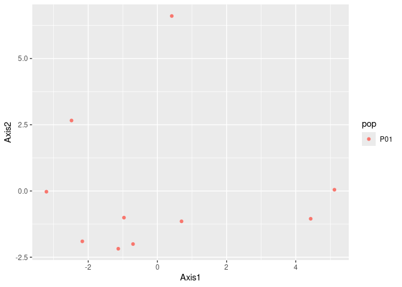
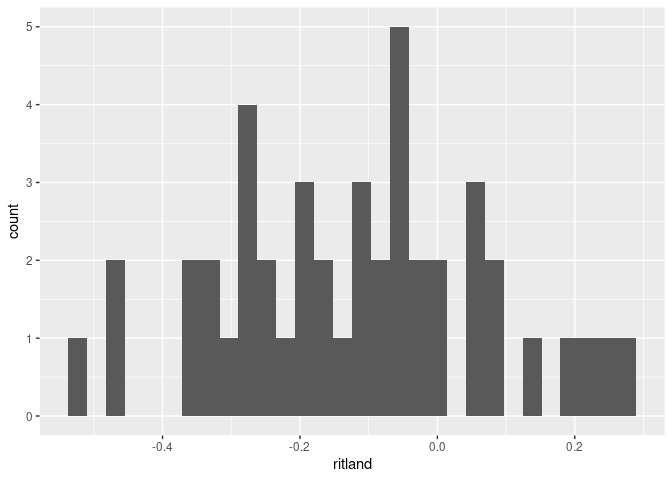

# {pantomime}

Utilities for tidy population genetics analysis in R

## Installation

``` r
remotes::install_github("chollenbeck/pantomime")
```

## Data exploration

``` r
library(pantomime)
```

    ## Registered S3 method overwritten by 'pegas':
    ##   method      from
    ##   print.amova ade4

``` r
library(related)
```

    ## Loading required package: tools

``` r
data(nancycats) # From adegenet

# Extract allele frequencies from a genind object
cats1 <- nancycats[pop = 1]
df <- get_allele_freqs(cats1)

head(df)
```

    ## # A tibble: 6 × 4
    ##   pop   locus allele  freq
    ##   <chr> <chr> <chr>  <dbl>
    ## 1 P01   fca8  117        0
    ## 2 P01   fca8  119        0
    ## 3 P01   fca8  121        0
    ## 4 P01   fca8  123        0
    ## 5 P01   fca8  127        0
    ## 6 P01   fca8  129        0

Get locus-by-locus statistics:

``` r
cat_stats <- get_locus_stats(cats1, hwe_test = TRUE)

cat_stats
```

    ## # A tibble: 9 × 9
    ##   locus pop   n_alleles prop_missing   maf    ho    he     fis hwe_pval
    ##   <chr> <chr>     <int>        <dbl> <dbl> <dbl> <dbl>   <dbl>    <dbl>
    ## 1 fca23 P01           5          0       0  0.7  0.722  0.0308    0.002
    ## 2 fca37 P01           3          0       0  0.2  0.367  0.454     0.101
    ## 3 fca43 P01           5          0       0  0.7  0.783  0.106     0.409
    ## 4 fca45 P01           3          0       0  0.8  0.672 -0.190     0.728
    ## 5 fca77 P01           6          0       0  0.5  0.8    0.375     0.039
    ## 6 fca78 P01           2          0       0  0.6  0.522 -0.149     1    
    ## 7 fca8  P01           4          0.2     0  0.75 0.634 -0.183     0.694
    ## 8 fca90 P01           5          0       0  0.4  0.744  0.463     0.023
    ## 9 fca96 P01           3          0       0  0.5  0.633  0.210     0.307

Get locus diversity statistics:

``` r
cat_div <- get_locus_diversity(cats1)

cat_div
```

    ## # A tibble: 9 × 6
    ##   locus pop   n_alleles shannon hexp_nei evenness
    ##   <chr> <chr>     <int>   <dbl>    <dbl>    <dbl>
    ## 1 fca8  P01           4   1.10     0.642    0.749
    ## 2 fca23 P01           5   1.33     0.721    0.781
    ## 3 fca43 P01           5   1.44     0.779    0.883
    ## 4 fca45 P01           3   1.07     0.679    0.953
    ## 5 fca77 P01           6   1.51     0.784    0.828
    ## 6 fca78 P01           2   0.693    0.526    1    
    ## 7 fca90 P01           5   1.32     0.726    0.813
    ## 8 fca96 P01           3   0.997    0.626    0.859
    ## 9 fca37 P01           3   0.639    0.358    0.576

## Quick PCA

Run a quick PCA of the data

``` r
pca_tbl <- qpca(cats1)
```

    ## Warning in .local(x, ...): Some scaling values are null.
    ##  Corresponding alleles are removed.

``` r
ggplot(pca_tbl, aes(x = Axis1, y = Axis2, col = pop)) +
  geom_point()
```

<!-- -->

## Relatedness

``` r
# Calculate relatedness from a genind object
rel <- genind2related(cats1)
coanc <- coancestry(genotype.data = rel$gdata, ritland = 1) # From the 'related' package
```

    ##    user  system elapsed 
    ##   0.002   0.004   0.007 
    ## 
    ## Reading output files into data.frames... Done!

``` r
# Convert to tibble
rel_tbl <- coanc$relatedness %>%
  as_tibble()

head(rel_tbl)
```

    ## # A tibble: 6 × 11
    ##   pair.no ind1.id ind2.id group trioml  wang lynchli lynchrd ritland quellergt
    ##     <int> <chr>   <chr>   <chr>  <dbl> <dbl>   <dbl>   <dbl>   <dbl>     <dbl>
    ## 1       1 N215    N216    N2N2       0     0       0       0  0.276     0.628 
    ## 2       2 N215    N217    N2N2       0     0       0       0 -0.0187   -0.0453
    ## 3       3 N215    N218    N2N2       0     0       0       0 -0.106    -0.0084
    ## 4       4 N215    N219    N2N2       0     0       0       0 -0.116    -0.0762
    ## 5       5 N215    N220    N2N2       0     0       0       0 -0.0594   -0.0204
    ## 6       6 N215    N221    N2N2       0     0       0       0  0.0939    0.304 
    ## # ℹ 1 more variable: dyadml <dbl>

Quickly visualize the distribution of Ritland relatedness coefficients:

``` r
ggplot(rel_tbl, aes(x = ritland)) +
  geom_histogram()
```

    ## `stat_bin()` using `bins = 30`. Pick better value with `binwidth`.

<!-- -->
